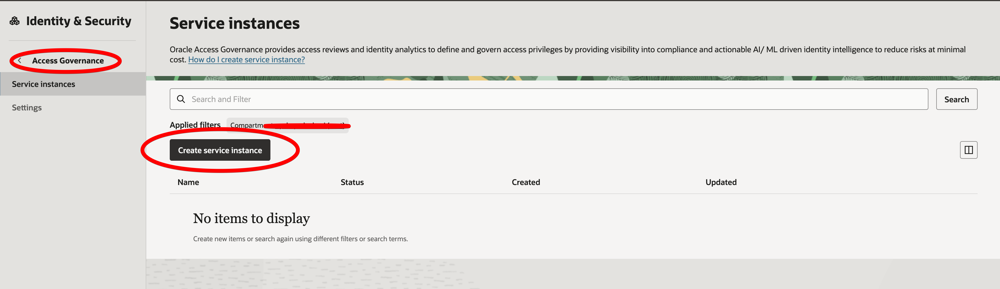

# Oracle Access Governance (OAG)

Oracle Access Governance is OCI's cloud-native governance platform for managing access reviews, compliance certifications, and identity analytics. It replaces Oracle Identity Governance (OIG) for cloud environments.

---

## Accessing OAG via OCI Console

1. Sign in to the [OCI Console](https://cloud.oracle.com)
2. Open the navigation menu (☰)
3. Navigate to: **Identity & Security → Access Governance**
4. Select your:
   - Subscription region
   - Governance instance (if multiple exist)

---

## Dashboard Capabilities

| Capability | Description |
|------------|-------------|
| **Access Reviews / Certifications** | Periodically certify who has access to what |
| **Segregation of Duties (SoD)** | Detect and remediate conflicting access combinations |
| **Access Requests** | Self-service access request and approval workflows |
| **Role Mining** | Discover and rationalize roles based on actual usage |
| **Identity Analytics** | Visualize access risk and entitlement trends |
| **Policy Controls** | Define and enforce governance policies |
| **Connected Applications** | Integrate with OCI, on-prem, and SaaS applications |

---

## When to Use OAG vs OIG

| Scenario | Recommended Product |
|----------|---------------------|
| Cloud-native OCI deployment | **Oracle Access Governance** |
| On-premises or hybrid (legacy) | Oracle Identity Governance (OIG) |
| Healthcare compliance (cloud) | **Oracle Access Governance** |

---

## Related

- [Oracle Identity Governance](oracle-identity-governance.md)
- [Access Governance Setup Guide](../guides/access-governance-setup.md)
- [Healthcare IAM](healthcare-iam.md)
