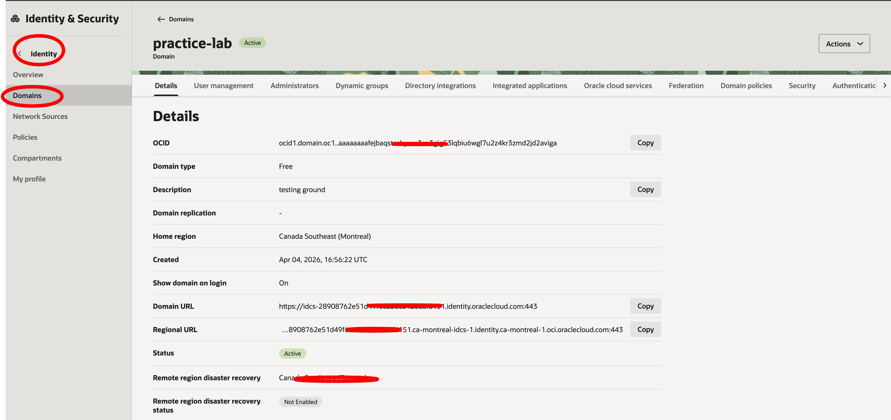

# Oracle Identity Governance (OIG)

Oracle Identity Governance is Oracle's traditional on-premises identity governance solution. In OCI, it has been largely superseded by **Oracle Access Governance**, which is the recommended cloud-native alternative.

> ⚠️ **Note:** OIG is primarily an on-prem product. For new OCI deployments, use [Oracle Access Governance](oracle-access-governance.md) instead.




## OCI Marketplace Deployment

OIG can be deployed in OCI via the Marketplace for organizations that need it in a cloud-hosted environment.

### Steps

1. Open the [OCI Console](https://cloud.oracle.com)
2. Navigate to one of:
   - **Compute → Instances**
   - **Marketplace → Installed Applications**
3. Locate the application (search for):
   - `Oracle Identity Governance`
   - `OIG`
   - `IAM Suite`
4. Open the **load balancer / public IP** assigned to the instance
5. Access the application at:
   - `/identity` — end-user portal
   - `/sysadmin` — system administrator console

---

## Use Cases (Legacy / Hybrid)

- Organizations with existing on-prem OIG investment
- Hybrid environments requiring both cloud and on-prem governance
- Regulated industries with specific OIG-based compliance tooling

---

## Migration Path

```
Oracle Identity Governance (on-prem)
          ↓
Oracle Access Governance (OCI-native)
```

Oracle recommends migrating governance workflows to Access Governance over time.

---

## Related

- [Oracle Access Governance](oracle-access-governance.md)
- [OIG Marketplace Deployment Guide](../guides/oig-marketplace-deployment.md)
